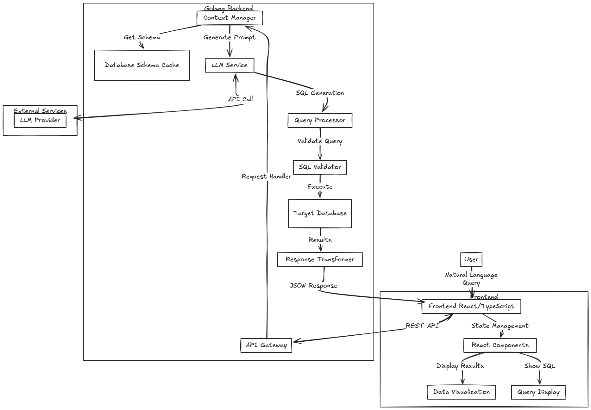

# Smart Insights

[](https://opensource.org/licenses/MIT)

## Overview
Smart Insights is a powerful self-service data analytics solution that democratizes data access within organizations.
By leveraging Large Language Models (LLMs), it enables non-technical users to derive valuable database insights 
through natural language queries, eliminating the need for SQL expertise.

## 🚀 Key Features

- **Natural Language Queries**: Convert plain English questions into accurate database queries
- **Multi-Database Support**: Compatible with PostgreSQL, MySQL, and MongoDB
- **Flexible LLM Integration**: Support for multiple providers including OpenAI, Anthropic, AWS Bedrock, and Google Gemini
- **Real-time Analytics**: Get instant insights from your data
- **User-Friendly Interface**: Simple, intuitive interface for business users

## 💡 Why Smart Insights?

- 23x higher customer acquisition rate for data-driven companies
- Up to 50% increase in business user productivity with self-service analytics
- Reduces bottlenecks in data access and analysis
- Bridges the data skills gap in organizations
- Enables faster, data-driven decision-making

## 🏗️ Architecture

Smart Insights consists of three core components:
1. **Database Integrations**: Connect with various database systems
2. **LLM Integrations**: Leverage multiple LLM providers for natural language processing
3. **Insights Generation Orchestrator**: Manage the end-to-end process from query to insights

## 🎥 Demo

Watch our solution presentation [here](https://www.loom.com/share/412d07157f7a435daafe7dcd44507fb9?sid=aada1e2a-9577-4669-9a0c-4f983d1034fb).

## 🚀 Quick Start

### Prerequisites
- Docker and Docker Compose installed
- OpenAI API key (or other supported LLM provider keys)

### Installation

1. Clone the repository:
```bash
git clone https://github.com/shahariaazam/smart-insights.git
cd smart-insights
```

2. Start the application:
```bash
docker-compose up -d --build
```

3. Initialize test database:
```bash
cat sql_for_test_db.sql | docker exec -i postgres_db psql -U postgres -d test
```

4. Access the application at `http://localhost:8080`

### Configuration

#### Database Configuration
```yaml
Type: PostgreSQL
DB Name: test
DB User: postgres
DB Password: pass
DB Host: postgres_db
Port: 5432
```

#### LLM Configuration
```yaml
Provider: OpenAI
API Key: <Your-API-Key>
Model: gpt-4
Max Tokens: 1000
```

## 🔍 Sample Queries

Try these example queries to get started:
- "Show me the top 5 products by sales volume"
- "What are the least selling products?"
- "Analyze sales breakdown by year"

## 🛑 Stopping the Application

```bash
docker-compose down
```

## Tools & Technologies Used

- Go (Golang as the backend codebase)
- PostgreSQL (Database to store configurations and user data)
- Docker (Containerization)
- OpenAI API (Natural Language Processing & Insights Generation)
- React using [Vite](https://vite.dev/) (Frontend UI)

## Technical Diagram



Link: [ExcaliDraw](https://excalidraw.com/#json=WCHBVRafCIcL6iHFs0kna,Rdy7TOtJB-jNCcCSPB2KTw)

## 🤝 Contributing

Contributions are welcome! Please feel free to submit a Pull Request.

## 📝 License

This project is licensed under the MIT License - see the [LICENSE](LICENSE) file for details.

## 🙏 Acknowledgments

- Built during the AI Hackathon
- Inspired by the need for accessible data analytics

## Disclaimer

Almost 70% of the code has been generated by Anthropic's Claude 3.5 Sonnet model.
The code is not production-ready and should be used for educational purposes only.

## 📫 Contact

For questions and feedback, please [open an issue](https://github.com/shahariaazam/smart-insights/issues) or reach out to the maintainers.